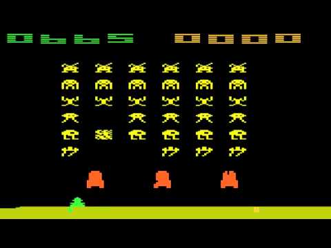

# Space Invaders - JavaScript and DOM Manipulation

## Background

Aliens are invading Earth and we need to log all sightings and descriptions
The project uses JavaScript, HTML, CSS, and D3.js to accumulate, and render the sighting logs. 

### Part 1: Automatic Table and Date Search 

* Created a basic HTML web page 

* Using the UFO dataset provided in the form of an array of JavaScript objects, write code that appends a table to your web page and then adds new rows of data for each UFO sighting.

* Use a date form in your HTML document and write JavaScript code that will listen for events and search through the `date/time` column to find rows that match user input.

### Part 2: Multiple Search Categories

* Using multiple `input` tags and/or select dropdowns, write JavaScript code so the user can to set multiple filters and search for UFO sightings using the following criteria based on the table columns:

  1. `date/time`
  2. `city`
  3. `state`
  4. `country`
  5. `shape`
- - -

### Code Execution Instructions
Lorem Ipsum

### Copyright

UCSD Data Science Bootcamp © 2019. All Rights Reserved.
